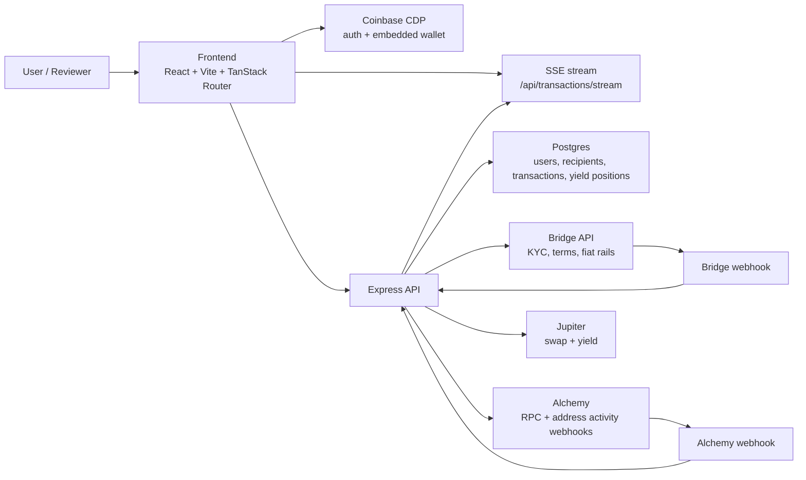

# Monra

Monra is a stablecoin treasury operations app built for fast cross-border money movement. It combines Coinbase CDP embedded wallets on the frontend with an Express + Postgres backend that tracks users, recipients, fiat rails, swaps, yield positions, and transaction history in one place.

This README is the source of truth for hackathon reviewers. It explains what the product does, how the codebase is structured, which services it depends on, and how to run and verify it locally.

## Live links

- App: [https://app.monra.io](https://app.monra.io)
- API: [https://api.monra.io](https://api.monra.io)

## What Monra does

- Onboards a user from Coinbase CDP auth into a local Monra profile
- Syncs Bridge compliance state for KYC and terms acceptance
- Shows a treasury dashboard for SOL, USDC, EURC, and yield-invested USDC
- Saves wallet and bank recipients
- Creates on-ramp flows from EUR into USDC or EURC
- Creates off-ramp flows from EURC or USDC back to SEPA bank accounts
- Quotes and executes swaps through Jupiter
- Tracks yield deposits and withdrawals for Jupiter Earn
- Streams recent transaction activity live over SSE

## Suggested review flow

1. Open [https://app.monra.io](https://app.monra.io) and sign in with Coinbase CDP email auth.
2. Complete onboarding to create the local Monra user and Bridge-linked profile.
3. Review the dashboard treasury cards, asset balances, and recent activity feed.
4. Add a wallet or bank recipient to see recipient management and Bridge-backed bank account creation.
5. Test on-ramp and off-ramp flows if KYC and terms acceptance are complete.
6. Test swap and yield flows from the funded treasury wallet.
7. Open the transactions page and confirm new activity appears without a full page refresh.

## Tech stack

### Frontend

- React 19
- Vite 7
- TanStack Router
- TanStack React Query
- Coinbase CDP React, hooks, and core packages
- Tailwind CSS 4
- Solana Web3.js

### Backend

- Express 5
- TypeScript
- Postgres via `pg`
- Coinbase CDP SDK
- Bridge API
- Alchemy RPC + webhooks
- Jupiter swap and yield integrations
- Zod for request validation

## Monorepo layout

```text
.
|- frontend/
|  |- src/
|  |  |- CoinbaseAppRoot.tsx
|  |  |- App.tsx
|  |  |- router-instance.ts
|  |  |- lib/api-client.ts
|  |  |- routes/
|  |  `- features/
|  `- .env.example
|- backend/
|  |- src/
|  |  |- index.ts
|  |  |- routes/
|  |  |- services/
|  |  |- lib/
|  |  `- db/
|  `- .env.example
`- README.md
```

### Responsibilities

- `frontend/` owns the product UI, Coinbase auth shell, wallet interactions, route loading, React Query caching, and the live transaction stream client.
- `backend/` owns authenticated API routes, onboarding state, Bridge and Alchemy integrations, Jupiter integrations, database migrations, ledger persistence, webhook ingestion, reconciliation, and SSE fan-out.

## Architecture



## Backend architecture

### Entry point

- `backend/src/index.ts` boots the server, initializes the database, initializes the transaction stream listener, mounts all route groups, exposes `/health` and `/ready`, and starts the optional reconciliation job.

### Auth and session bootstrap

- `backend/src/auth/requestAuth.ts` validates the bearer token through Coinbase CDP and attaches either the raw auth identity or the full local Monra user to the request.
- `backend/src/routes/auth.ts` is the frontend bootstrap entrypoint. It decides whether a user is still in onboarding or already active, and it opportunistically refreshes Bridge compliance state for active users.

### Onboarding and Bridge compliance

- `backend/src/routes/onboarding.ts` validates the onboarding form and hands off to `backend/src/lib/onboardingFlow.ts`.
- `backend/src/lib/onboardingFlow.ts` creates the local user record first, then creates the Bridge customer and related compliance state. If Bridge fails after the local write, retrying resumes the flow instead of duplicating the user.
- `backend/src/routes/bridge.ts` lets the frontend force a Bridge status refresh after KYC or terms acceptance.

### Route groups

- `backend/src/routes/users.ts`
  - saves the user's Solana address
  - updates the Alchemy webhook watchlist
  - returns balances, valuation, and yield snapshot
  - returns transaction context for Solana sends
- `backend/src/routes/recipients.ts`
  - creates wallet recipients locally
  - creates bank recipients locally and in Bridge
  - deletes recipients and rolls back Bridge external accounts when needed
  - uses idempotency tracking via `bridgeRequestSessionsService`
- `backend/src/routes/onramp.ts`
  - creates pending Bridge deposit transfers for EUR to USDC or EURC
- `backend/src/routes/offramp.ts`
  - creates pending Bridge off-ramp transfers against saved bank recipients
- `backend/src/routes/swaps.ts`
  - `/order` creates and stores a swap quote
  - `/execute` persists the executed swap after the signed transaction is returned
- `backend/src/routes/yield.ts`
  - returns tracked yield positions
  - reconciles yield deposits and withdrawals after the frontend submits the signed transaction
- `backend/src/routes/transactions.ts`
  - returns paginated transaction history
  - issues short-lived stream tokens
  - opens the server-sent events feed used for live dashboard updates
- `backend/src/routes/webhooks.ts`
  - validates Bridge and Alchemy webhook signatures from raw request bodies
  - normalizes webhook payloads into local ledger changes
  - broadcasts updated snapshots to connected clients

### Database and migrations

- `backend/src/db/bootstrap.ts` decides whether to apply the full schema or only pending migrations based on existing core tables.
- `backend/src/db/schema.sql` is the fresh-schema bootstrap.
- `backend/src/db/migrations/` contains ordered SQL migrations for recipients, transactions, ledger cutover, EURC/off-ramp/swap support, runtime state, public IDs, idempotency, and yield tracking.
- `backend/src/db/repositories/` contains the read/write data access layer for users, recipients, transactions, webhooks, and yield positions.

### Webhooks, ledger normalization, and reconciliation

- `backend/src/services/webhooksService.ts` translates Bridge and Alchemy webhook events into local effects, including:
  - transaction ledger inserts
  - on-ramp completion
  - off-ramp broadcast confirmation
  - recipient attribution for wallet transfers
- `backend/src/lib/transactionStream.ts` publishes and fans out the latest transaction snapshot through Postgres-backed events plus in-process SSE fallback.
- `backend/src/lib/reconciliation.ts` optionally checks balance mismatches and stale pending transfers on an interval. It is disabled when `RECONCILIATION_INTERVAL_MS=0`.

### Operational endpoints

- `/health` returns a simple process-level success response
- `/ready` verifies application readiness, including database and transaction-stream state

## Frontend architecture

### Provider shell

- `frontend/src/main.tsx` lazy-loads the application root.
- `frontend/src/CoinbaseAppRoot.tsx` composes the CDP React provider, API client context, React Query provider, toast provider, and TanStack router.

### App state bootstrap

- `frontend/src/App.tsx` is the frontend state machine for:
  - CDP initialization
  - backend session bootstrap
  - unauthenticated state
  - onboarding state
  - authenticated state
- `frontend/src/features/session/use-session-bootstrap.ts` calls `POST /api/auth/session` and decides whether to show onboarding or the app shell.

### API layer

- `frontend/src/lib/api-client.ts` is the typed API client for all backend calls.
- `frontend/src/api.ts` composes multi-request frontend view models such as the dashboard snapshot.

### Routing and lazy loading

- `frontend/src/router-instance.ts` defines the product routes:
  - `/`
  - `/profile`
  - `/recipients`
  - `/swap`
  - `/yield`
  - `/transactions`
- Each route is lazy-loaded with TanStack Router.
- `frontend/src/lib/lazy-with-chunk-retry.ts` retries stale lazy chunks once by forcing a reload if the browser cached an old chunk URL.

### React Query and live updates

- `frontend/src/features/dashboard/use-dashboard-snapshot.ts` fetches balances plus the latest transactions and keeps polling unless live updates are active.
- `frontend/src/features/transactions/transaction-stream-provider.tsx` fetches an SSE token, opens the event stream, merges streamed snapshots into the React Query cache, and raises user-facing toast notifications for confirmed transfers.
- `frontend/src/features/transactions/use-transaction-stream-status.ts` exposes stream health to pages such as Dashboard and Yield.

### Product surfaces

- `frontend/src/Dashboard.tsx` handles the main treasury view, quick actions, deposits, on-ramp, off-ramp, send, and Bridge compliance prompts.
- `frontend/src/RecipientsPage.tsx` manages recipient creation and deletion.
- `frontend/src/SwapPage.tsx` requests swap quotes, refreshes them in the background, and executes the signed swap.
- `frontend/src/YieldPage.tsx` shows yield metrics, prepares deposit/withdraw transactions, and reconciles them after broadcast.
- `frontend/src/ProfilePage.tsx` exposes wallet export and MFA state.

## Environment variables

### Frontend public variables

These are safe to expose at build time.

| Variable | Required | Purpose |
| --- | --- | --- |
| `VITE_API_BASE_URL` | Yes | Base URL for the Express API. Required for non-development builds. |
| `VITE_CDP_PROJECT_ID` | Yes | Coinbase CDP project identifier used by the embedded wallet provider. |
| `VITE_CDP_CREATE_SOLANA_ACCOUNT` | Yes for this app | Enables Solana account creation on login. |
| `VITE_SOLANA_RPC_URL` | Yes | Public Solana RPC endpoint used by frontend wallet operations. Required for non-development builds. |
| `VITE_CDP_CREATE_ETHEREUM_ACCOUNT_TYPE` | No | Optional CDP EVM account mode (`eoa` or `smart`). |

### Backend server-only variables

These must stay on the server.

| Variable | Required | Purpose |
| --- | --- | --- |
| `PORT` | No | Backend port. Defaults to `4000`. |
| `ALLOWED_ORIGINS` | Yes | Comma-separated CORS allowlist. |
| `DATABASE_URL` | Yes | Postgres connection string. |
| `CDP_API_KEY_ID` | Yes | Coinbase CDP server API key id. |
| `CDP_API_KEY_SECRET` | Yes | Coinbase CDP server API key secret. |
| `ALCHEMY_API_KEY` | Yes | Alchemy RPC key for balances and transaction inspection. |
| `ALCHEMY_WEBHOOK_ID` | Yes | Alchemy address activity webhook id. |
| `ALCHEMY_WEBHOOK_AUTH_TOKEN` | Yes | Alchemy webhook auth token. |
| `ALCHEMY_WEBHOOK_SIGNING_KEY` | Yes | Alchemy webhook signing secret. |
| `BRIDGE_API_KEY` | Yes | Bridge API key. |
| `BRIDGE_API_BASE_URL` | No | Bridge base URL. Defaults to `https://api.bridge.xyz/v0`. |
| `BRIDGE_WEBHOOK_PUBLIC_KEY` | Yes | Public key used to verify Bridge webhook signatures. |
| `BRIDGE_WEBHOOK_MAX_AGE_MS` | No | Maximum accepted Bridge webhook age. |
| `JUPITER_API_KEY` | No | Optional Jupiter API key. |
| `JUPITER_API_BASE_URL` | No | Jupiter base URL. Defaults to `https://api.jup.ag/swap/v2`. |
| `STREAM_TOKEN_SECRET` | Yes in production | Secret used to sign transaction stream tokens. |
| `OUTBOUND_REQUEST_RETRIES` | No | Retry count for outbound provider requests. |
| `OUTBOUND_REQUEST_TIMEOUT_MS` | No | Timeout for outbound provider requests. |
| `PG_POOL_MAX` | No | Postgres pool size. |
| `PG_POOL_IDLE_TIMEOUT_MS` | No | Postgres idle timeout. |
| `PG_POOL_CONNECTION_TIMEOUT_MS` | No | Postgres connection timeout. |
| `PG_POOL_MAX_LIFETIME_SECONDS` | No | Postgres connection lifetime. |
| `ALCHEMY_WEBHOOK_CONCURRENCY` | No | Max concurrency when enriching Alchemy webhook signatures. |
| `RECONCILIATION_INTERVAL_MS` | No | Background reconciliation interval. Set `0` to disable. |

## Running locally

Use Node 22+ for the whole repo. The backend declares `>=20`, but the frontend requires `>=22`, so using Node 22 keeps both apps aligned.

### 1. Copy the example env files

```bash
cp frontend/.env.example frontend/.env
cp backend/.env.example backend/.env
```

Fill in real provider values where required.

### 2. Install dependencies

```bash
cd backend
npm install

cd ../frontend
npm install
```

### 3. Start the backend

```bash
cd backend
npm run dev
```

Backend default URL: `http://localhost:4000`

### 4. Start the frontend

```bash
cd frontend
npm run dev
```

Frontend default URL: `http://localhost:3000`

## Verification commands

### Backend

```bash
cd backend
npm test
npm run build
```

### Frontend

```bash
cd frontend
npm run lint
npm test
npm run build
```

Notes:

- Frontend production-style builds require `VITE_API_BASE_URL` and `VITE_SOLANA_RPC_URL`.
- This app also expects `VITE_CDP_PROJECT_ID` and `VITE_CDP_CREATE_SOLANA_ACCOUNT=true` for the CDP provider configuration.

## Reviewer notes

### External services required for full end-to-end validation

- Coinbase CDP for auth, access tokens, and embedded wallet flows
- Postgres for application state, ledger rows, and transaction stream events
- Alchemy for balances, parsed transactions, and address activity webhooks
- Bridge for KYC, terms, on-ramp, off-ramp, and bank external accounts
- Jupiter for swap quotes/execution and yield-related market data

### What can be validated locally

- Full frontend and backend test suites
- Frontend lint and production build
- Backend TypeScript build and database bootstrap behavior
- App startup, route loading, and API wiring with valid env configuration
- Live transaction streaming behavior when webhook delivery is configured

### Known limitations / next steps

- End-to-end fiat rails and webhook-driven transaction completion require live Bridge, Alchemy, and CDP credentials.
- The build no longer has the `coinbase-auth -> wallet-runtime -> coinbase-auth` circular chunk warning, but the `coinbase-auth` bundle is still large because it contains the CDP auth UI.
- The reconciliation worker is opt-in through `RECONCILIATION_INTERVAL_MS`; leaving it at `0` keeps local development simpler.
